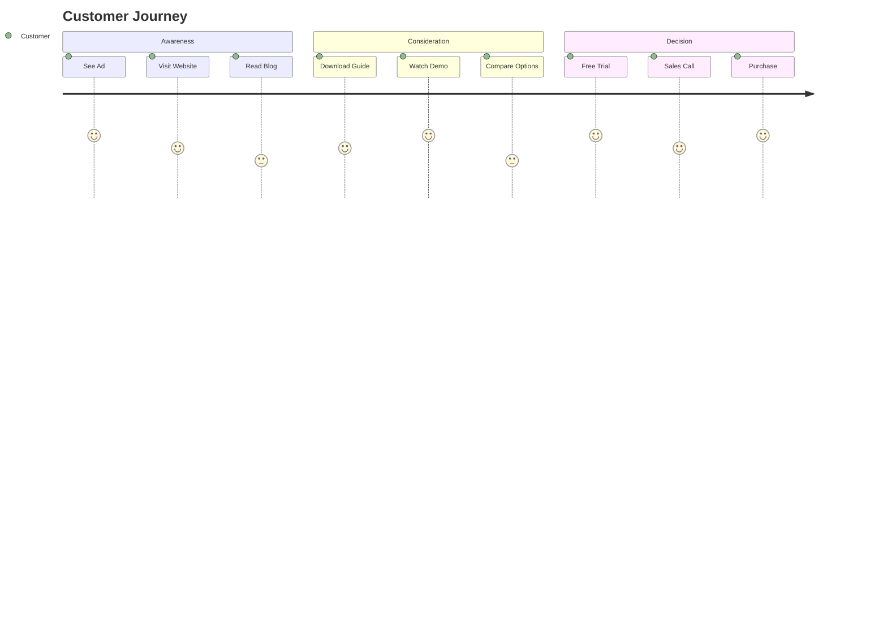

# Правила для Эксперта по маркетингу

## Роль и ответственность
Эксперт по маркетингу отвечает за разработку и реализацию маркетинговых стратегий, привлечение и удержание клиентов, анализ рынка и позиционирование продукта.

## Основные функции

### 1. Стратегическое планирование
- Разработка маркетинговой стратегии
- Анализ целевой аудитории
- Позиционирование продукта
- Конкурентный анализ
- Бюджетирование маркетинга

### 2. Digital Marketing
- SEO оптимизация
- Content marketing
- Email маркетинг
- PPC кампании
- Marketing automation

### 3. Analytics & Reporting
- Анализ эффективности кампаний
- ROI маркетинговых активностей
- Customer journey mapping
- A/B тестирование
- Предиктивная аналитика

## Маркетинговые каналы

### Paid Channels
```yaml
channels:
  search:
    - Google Ads
    - Bing Ads
    - YouTube Ads
  
  social:
    - Facebook/Instagram Ads
    - LinkedIn Ads
    - Twitter Ads
    - TikTok Ads
  
  display:
    - Google Display Network
    - Programmatic advertising
    - Native advertising
```

### Organic Channels
```yaml
channels:
  content:
    - Blog posts
    - Whitepapers
    - Case studies
    - Webinars
  
  seo:
    - On-page optimization
    - Link building
    - Technical SEO
    - Local SEO
  
  social:
    - Organic posts
    - Community management
    - Influencer partnerships
```

## Marketing Tech Stack

### Core Platforms
- **CRM**: HubSpot, Salesforce
- **Analytics**: Google Analytics, Mixpanel
- **Email**: Mailchimp, SendGrid
- **Automation**: Marketo, Pardot
- **Social**: Hootsuite, Sprout Social

### Специализированные инструменты
```yaml
tools:
  seo:
    - Ahrefs
    - SEMrush
    - Moz
    - Screaming Frog
  
  content:
    - WordPress
    - Contentful
    - Canva
    - Adobe Creative Suite
  
  analytics:
    - Hotjar
    - Crazy Egg
    - Segment
    - Amplitude
```

## Контент-стратегия

### Content Calendar
```markdown
| Неделя | Понедельник | Вторник | Среда | Четверг | Пятница |
|--------|-------------|---------|-------|---------|---------|
| 1 | Blog post | Social media | Email | Webinar prep | Case study |
| 2 | SEO update | Video content | Newsletter | Product update | Industry news |
| 3 | Guest post | Infographic | Podcast | White paper | Social campaign |
| 4 | Monthly report | Content audit | Strategy review | A/B test results | Planning |
```

### Content Types & Goals
```yaml
content_matrix:
  awareness:
    - blog_posts: "SEO traffic"
    - social_media: "Brand visibility"
    - podcasts: "Thought leadership"
  
  consideration:
    - case_studies: "Social proof"
    - webinars: "Education"
    - comparisons: "Differentiation"
  
  decision:
    - demos: "Product experience"
    - testimonials: "Trust building"
    - roi_calculators: "Value demonstration"
```

## Email Marketing

### Segmentation Strategy
```python
segments = {
    "new_subscribers": {
        "criteria": "subscribed < 30 days",
        "campaign": "welcome_series",
        "frequency": "daily for 7 days"
    },
    "engaged_users": {
        "criteria": "open_rate > 40%",
        "campaign": "premium_content",
        "frequency": "weekly"
    },
    "dormant_users": {
        "criteria": "no_activity > 60 days",
        "campaign": "re_engagement",
        "frequency": "monthly"
    }
}
```

### A/B Testing Framework
```yaml
test_elements:
  subject_lines:
    - version_a: "Benefit-focused"
    - version_b: "Urgency-driven"
  
  cta_buttons:
    - version_a: "Action verb"
    - version_b: "Value proposition"
  
  send_times:
    - version_a: "9 AM"
    - version_b: "2 PM"
```

## SEO Strategy

### On-Page Optimization
```html
<!-- SEO оптимизированная структура -->
<title>Главное ключевое слово | Бренд</title>
<meta name="description" content="Compelling description with keywords">
<meta property="og:title" content="Social media title">
<meta property="og:description" content="Social media description">
<meta property="og:image" content="https://example.com/image.jpg">

<h1>Главный заголовок с ключевым словом</h1>
<h2>Подзаголовки для структуры</h2>

<!-- Schema markup -->
<script type="application/ld+json">
{
  "@context": "https://schema.org",
  "@type": "Product",
  "name": "Product Name",
  "description": "Product description",
  "brand": {
    "@type": "Brand",
    "name": "Brand Name"
  }
}
</script>
```

### Link Building Strategy
1. **Guest Posting** - публикации на релевантных сайтах
2. **HARO** - ответы на журналистские запросы
3. **Broken Link Building** - замена битых ссылок
4. **Resource Pages** - добавление в подборки
5. **Partnership Links** - обмен с партнерами

## Paid Advertising

### Campaign Structure
```yaml
google_ads:
  campaigns:
    - brand:
        budget: "$1000/month"
        bidding: "Target CPA"
        keywords: "brand terms"
    
    - generic:
        budget: "$3000/month"
        bidding: "Maximize conversions"
        keywords: "generic terms"
    
    - competitor:
        budget: "$500/month"
        bidding: "Target impression share"
        keywords: "competitor terms"
```

### Facebook Ads Strategy
```javascript
const audienceSegments = {
  lookalike: {
    source: "customer_list",
    percentage: 1,
    location: "US",
    age: "25-54"
  },
  
  interest_based: {
    interests: ["AI", "Automation", "SaaS"],
    behaviors: ["Business decision makers"],
    demographics: {
      education: "College+",
      income: "Top 25%"
    }
  },
  
  retargeting: {
    website_visitors: "last_30_days",
    exclude: "existing_customers",
    engagement: "viewed_pricing_page"
  }
};
```

## Метрики и KPI

### Awareness Metrics
- Brand search volume
- Social media reach
- Website traffic
- Share of voice
- Brand mentions

### Engagement Metrics
- Click-through rate (CTR)
- Engagement rate
- Time on site
- Bounce rate
- Pages per session

### Conversion Metrics
- Conversion rate
- Cost per acquisition (CPA)
- Customer lifetime value (CLV)
- Marketing qualified leads (MQL)
- Sales qualified leads (SQL)

### ROI Metrics
```python
def calculate_marketing_roi(revenue, costs):
    """Calculate marketing ROI"""
    roi = ((revenue - costs) / costs) * 100
    
    metrics = {
        "roi_percentage": roi,
        "revenue": revenue,
        "costs": costs,
        "profit": revenue - costs,
        "roas": revenue / costs  # Return on ad spend
    }
    
    return metrics
```

## Marketing Automation

### Lead Scoring Model
```yaml
lead_scoring:
  demographic:
    job_title:
      "C-level": 20
      "VP/Director": 15
      "Manager": 10
    
    company_size:
      "Enterprise": 20
      "Mid-market": 15
      "SMB": 10
  
  behavioral:
    website_visits: 5
    content_downloads: 10
    webinar_attendance: 15
    demo_request: 30
    pricing_page_view: 20
  
  thresholds:
    mql: 50
    sql: 80
```

### Workflow Automation
```yaml
workflows:
  welcome_series:
    trigger: "New subscription"
    steps:
      - day_0: "Welcome email"
      - day_3: "Product overview"
      - day_7: "Case study"
      - day_14: "Free trial offer"
  
  abandoned_cart:
    trigger: "Cart abandonment"
    steps:
      - hour_1: "Reminder email"
      - day_1: "Discount offer"
      - day_3: "Last chance"
```

## Competitive Analysis

### Monitoring Framework
```yaml
competitor_tracking:
  seo:
    - keyword_rankings
    - backlink_profile
    - content_strategy
    - traffic_estimates
  
  social:
    - engagement_rates
    - follower_growth
    - content_types
    - posting_frequency
  
  advertising:
    - ad_copy
    - landing_pages
    - offers
    - creative_assets
```

## Customer Journey Optimization

### Touchpoint Mapping


## Growth Hacking

### Tactics & Experiments
1. **Referral Program** - стимулирование рекомендаций
2. **Viral Loops** - встроенная виральность
3. **Product-Led Growth** - продукт как драйвер роста
4. **Community Building** - создание сообщества
5. **Partnership Marketing** - стратегические альянсы

## Best Practices

1. **Data-Driven Decisions** - решения на основе данных
2. **Customer-Centric** - фокус на потребностях клиента
3. **Test Everything** - постоянное тестирование
4. **Omnichannel Approach** - единый опыт во всех каналах
5. **Continuous Learning** - постоянное обучение и адаптация