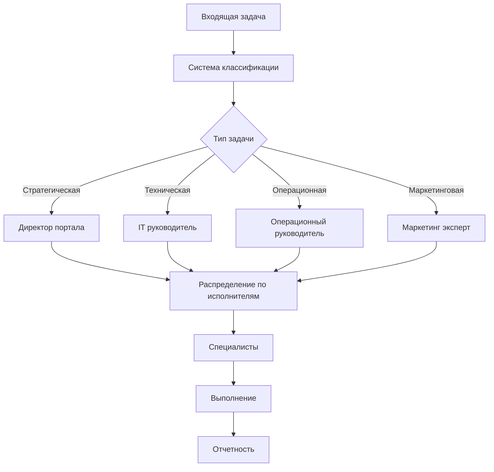

# Система распределения задач AI Portal

## Архитектура системы

### Уровни принятия решений



## Матрица распределения задач

### Классификация задач

```yaml
task_categories:
  strategic:
    owner: "portal_director"
    delegates_to:
      - development_director
      - financial_consultant
    task_types:
      - business_planning
      - partnerships
      - investment_decisions
      - product_strategy
      
  technical:
    owner: "it_department_head"
    delegates_to:
      - programmer
      - ai_llm_specialist
      - flowise_specialist
      - bigdata_specialist
    task_types:
      - infrastructure
      - development
      - integrations
      - performance_optimization
      
  operational:
    owner: "operations_department_head"
    delegates_to:
      - project_manager
      - nocode_lowcode_specialist
      - reports_specialist
      - backup_specialist
    task_types:
      - process_optimization
      - automation
      - reporting
      - maintenance
      
  marketing:
    owner: "marketing_expert"
    delegates_to:
      - smm_expert
      - international_clients_specialist
      - prompt_engineer
    task_types:
      - campaigns
      - content_creation
      - customer_acquisition
      - brand_management
```

## Workflow автоматизации

### n8n Workflow для распределения задач

```json
{
  "name": "Task Distribution System",
  "nodes": [
    {
      "id": "webhook",
      "type": "n8n-nodes-base.webhook",
      "parameters": {
        "path": "new-task",
        "responseMode": "onReceived",
        "options": {}
      }
    },
    {
      "id": "classify_task",
      "type": "n8n-nodes-base.function",
      "parameters": {
        "functionCode": "// AI-powered task classification\nconst taskData = $input.all()[0].json;\nconst classification = await classifyTask(taskData);\n\nreturn [{\n  json: {\n    ...taskData,\n    category: classification.category,\n    priority: classification.priority,\n    estimatedTime: classification.estimatedTime,\n    suggestedAssignee: classification.assignee\n  }\n}];"
      }
    },
    {
      "id": "route_by_category",
      "type": "n8n-nodes-base.switch",
      "parameters": {
        "dataPropertyName": "category",
        "rules": [
          {
            "value": "strategic",
            "output": 0
          },
          {
            "value": "technical",
            "output": 1
          },
          {
            "value": "operational",
            "output": 2
          },
          {
            "value": "marketing",
            "output": 3
          }
        ]
      }
    },
    {
      "id": "assign_specialist",
      "type": "n8n-nodes-base.function",
      "parameters": {
        "functionCode": "// Assign to specific specialist based on task details\nconst task = $input.all()[0].json;\nconst specialist = await findBestSpecialist(task);\n\nreturn [{\n  json: {\n    ...task,\n    assignedTo: specialist.id,\n    assignedName: specialist.name,\n    department: specialist.department\n  }\n}];"
      }
    },
    {
      "id": "create_ticket",
      "type": "n8n-nodes-base.httpRequest",
      "parameters": {
        "url": "https://api.ticketing.system/tickets",
        "method": "POST",
        "authentication": "predefinedCredentialType",
        "jsonParameters": true,
        "options": {}
      }
    },
    {
      "id": "notify_assignee",
      "type": "n8n-nodes-base.telegram",
      "parameters": {
        "chatId": "={{$json.assignedTo}}",
        "text": "Новая задача назначена вам:\n\n*{{$json.title}}*\n\nПриоритет: {{$json.priority}}\nОписание: {{$json.description}}\nСрок: {{$json.deadline}}\n\n[Открыть задачу]({{$json.ticketUrl}})",
        "additionalFields": {
          "parse_mode": "Markdown"
        }
      }
    }
  ]
}
```

## Правила эскалации

### Уровни эскалации

```python
escalation_rules = {
    "time_based": {
        "overdue_1_day": {
            "action": "notify_manager",
            "severity": "warning"
        },
        "overdue_3_days": {
            "action": "escalate_to_department_head",
            "severity": "high"
        },
        "overdue_7_days": {
            "action": "escalate_to_director",
            "severity": "critical"
        }
    },
    
    "priority_based": {
        "critical": {
            "immediate_notification": ["department_head", "on_call_specialist"],
            "sla": "2 hours",
            "escalation_time": "30 minutes"
        },
        "high": {
            "immediate_notification": ["assigned_specialist", "project_manager"],
            "sla": "4 hours",
            "escalation_time": "2 hours"
        },
        "medium": {
            "immediate_notification": ["assigned_specialist"],
            "sla": "24 hours",
            "escalation_time": "12 hours"
        }
    },
    
    "complexity_based": {
        "requires_multiple_specialists": {
            "action": "create_working_group",
            "coordinator": "project_manager"
        },
        "cross_department": {
            "action": "assign_liaison",
            "approver": "operations_head"
        }
    }
}
```

## Система отчетности

### Структура отчетов по департаментам

```yaml
reporting_structure:
  daily:
    technical_department:
      file: "/workspace/ai-portal-experts/reports/daily/tech_STATUS_YYYYMMDD.json"
      metrics:
        - tasks_completed
        - incidents_resolved
        - code_commits
        - system_uptime
        
    marketing_department:
      file: "/workspace/ai-portal-experts/reports/daily/marketing_STATUS_YYYYMMDD.json"
      metrics:
        - campaigns_launched
        - content_published
        - leads_generated
        - social_engagement
        
    operations_department:
      file: "/workspace/ai-portal-experts/reports/daily/ops_STATUS_YYYYMMDD.json"
      metrics:
        - processes_optimized
        - automations_created
        - tickets_processed
        - sla_compliance
        
  weekly:
    consolidated:
      file: "/workspace/ai-portal-experts/reports/weekly/consolidated_W{week}_YYYY.json"
      includes:
        - department_summaries
        - cross_functional_projects
        - resource_utilization
        - upcoming_priorities
```

## Интеграция специалистов

### Коллаборация между ролями

```python
collaboration_matrix = {
    "product_launch": {
        "lead": "project_manager",
        "team": [
            "programmer",
            "ai_llm_specialist",
            "marketing_expert",
            "smm_expert",
            "international_clients_specialist"
        ],
        "reviewers": [
            "it_department_head",
            "operations_department_head"
        ],
        "approvers": [
            "portal_director",
            "development_director"
        ]
    },
    
    "ai_implementation": {
        "lead": "ai_llm_specialist",
        "team": [
            "prompt_engineer",
            "flowise_specialist",
            "programmer",
            "nocode_lowcode_specialist"
        ],
        "consultants": [
            "bigdata_specialist",
            "reports_specialist"
        ],
        "stakeholders": [
            "project_manager",
            "it_department_head"
        ]
    },
    
    "international_expansion": {
        "lead": "international_clients_specialist",
        "team": [
            "marketing_expert",
            "smm_expert",
            "financial_consultant"
        ],
        "support": [
            "programmer",
            "backup_specialist"
        ],
        "decision_makers": [
            "portal_director",
            "development_director"
        ]
    }
}
```

## Автоматизация рутинных задач

### Скрипт автоматического распределения

```python
#!/usr/bin/env python3
import json
import requests
from datetime import datetime
from typing import Dict, List, Optional

class TaskDistributor:
    def __init__(self, config_path: str):
        with open(config_path, 'r') as f:
            self.config = json.load(f)
        
        self.specialists = self.load_specialists()
        self.task_queue = []
        
    def load_specialists(self) -> Dict:
        """Load specialist availability and skills"""
        specialists = {}
        
        for dept in ['strategic', 'technical', 'operational', 'marketing']:
            dept_file = f"/workspace/ai-portal-experts/departments/{dept}/specialists.json"
            try:
                with open(dept_file, 'r') as f:
                    specialists[dept] = json.load(f)
            except FileNotFoundError:
                specialists[dept] = {}
                
        return specialists
    
    def classify_task(self, task: Dict) -> Dict:
        """Classify task using AI or rule-based system"""
        # AI classification logic here
        keywords = task.get('description', '').lower()
        
        if any(word in keywords for word in ['strategy', 'planning', 'business']):
            category = 'strategic'
        elif any(word in keywords for word in ['code', 'bug', 'development', 'api']):
            category = 'technical'
        elif any(word in keywords for word in ['process', 'automation', 'report']):
            category = 'operational'
        elif any(word in keywords for word in ['marketing', 'campaign', 'social']):
            category = 'marketing'
        else:
            category = 'operational'  # default
            
        return {
            'category': category,
            'priority': self.determine_priority(task),
            'estimated_hours': self.estimate_time(task),
            'required_skills': self.identify_skills(task)
        }
    
    def find_best_specialist(self, task: Dict, classification: Dict) -> Optional[Dict]:
        """Find the best available specialist for the task"""
        category = classification['category']
        required_skills = classification['required_skills']
        
        available_specialists = []
        
        for specialist in self.specialists.get(category, {}).get('members', []):
            if self.is_specialist_available(specialist):
                skill_match = self.calculate_skill_match(specialist, required_skills)
                workload = self.get_current_workload(specialist['id'])
                
                available_specialists.append({
                    'specialist': specialist,
                    'score': skill_match * (1 - workload/100),
                    'availability': specialist.get('availability', 100)
                })
        
        if available_specialists:
            # Sort by score and return the best match
            best = sorted(available_specialists, key=lambda x: x['score'], reverse=True)[0]
            return best['specialist']
        
        return None
    
    def assign_task(self, task: Dict, specialist: Dict) -> bool:
        """Assign task to specialist and create notifications"""
        try:
            # Create task in project management system
            task_data = {
                'title': task['title'],
                'description': task['description'],
                'assignee': specialist['id'],
                'priority': task['priority'],
                'due_date': task.get('deadline'),
                'created_by': 'task_distribution_system',
                'created_at': datetime.now().isoformat()
            }
            
            # Log assignment
            self.log_assignment(task_data, specialist)
            
            # Send notifications
            self.notify_specialist(specialist, task_data)
            
            return True
            
        except Exception as e:
            print(f"Error assigning task: {e}")
            return False
    
    def log_assignment(self, task: Dict, specialist: Dict):
        """Log task assignment for reporting"""
        log_entry = {
            'timestamp': datetime.now().isoformat(),
            'task_id': task.get('id'),
            'specialist_id': specialist['id'],
            'specialist_name': specialist['name'],
            'department': specialist['department'],
            'task_category': task.get('category'),
            'priority': task.get('priority')
        }
        
        log_file = f"/workspace/ai-portal-experts/logs/assignments_{datetime.now().strftime('%Y%m%d')}.jsonl"
        
        with open(log_file, 'a') as f:
            f.write(json.dumps(log_entry) + '\n')

if __name__ == "__main__":
    distributor = TaskDistributor("/workspace/ai-portal-experts/config.json")
    # Main loop for processing tasks
```

## Мониторинг эффективности

### KPI по специалистам

```yaml
specialist_kpis:
  programmers:
    - tasks_completed_on_time: ">90%"
    - code_quality_score: ">85%"
    - bug_rate: "<5%"
    - documentation_completeness: ">80%"
    
  ai_specialists:
    - model_accuracy: ">90%"
    - response_time: "<500ms"
    - cost_per_request: "optimized"
    - innovation_score: "high"
    
  marketing_specialists:
    - lead_generation: "target+10%"
    - conversion_rate: ">3%"
    - content_engagement: ">5%"
    - roi: ">300%"
    
  operational_specialists:
    - process_efficiency: "+15% YoY"
    - automation_coverage: ">70%"
    - error_rate: "<1%"
    - sla_compliance: ">95%"
```

## Система обратной связи

### Continuous Improvement Loop

```python
class FeedbackSystem:
    def collect_feedback(self, task_id: str) -> Dict:
        """Collect feedback from all stakeholders"""
        feedback = {
            'task_id': task_id,
            'specialist_performance': self.get_specialist_feedback(task_id),
            'process_efficiency': self.get_process_feedback(task_id),
            'outcome_quality': self.get_quality_feedback(task_id),
            'recommendations': self.generate_recommendations(task_id)
        }
        return feedback
    
    def apply_learnings(self, feedback: Dict):
        """Apply learnings to improve the system"""
        # Update specialist skills matrix
        # Adjust task classification rules
        # Optimize assignment algorithms
        # Improve time estimations
        pass
```

## Best Practices для координации

1. **Clear Communication** - четкие каналы коммуникации между специалистами
2. **Defined Responsibilities** - ясное разделение ответственности
3. **Automated Workflows** - максимальная автоматизация рутины
4. **Continuous Monitoring** - постоянный мониторинг эффективности
5. **Feedback Integration** - учет обратной связи для улучшения системы